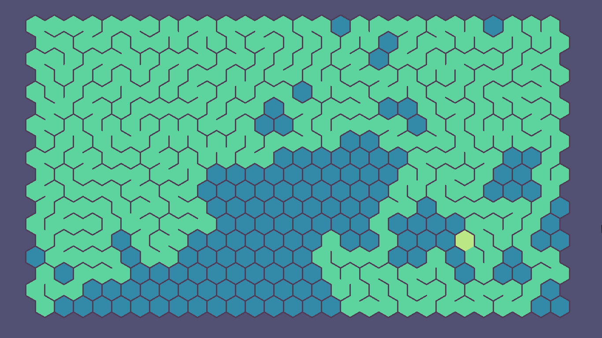

# hexamaze

A tiny experiment to generate mazes on a hexagonal grid.

[](https://gfycat.com/GlossyHideousAmericanblackvulture)

The algorithm used to generate the maze is a simple [recursive backtracker](https://en.wikipedia.org/wiki/Maze_generation_algorithm#Recursive_backtracker)

## How to build

```zsh
cabal install gloss random
cabal configure
cabal build
```

## How to run

```zsh
cabal run
```

## License

[MIT License](LICENSE)

Copyright (c) 2016 Basile Henry
